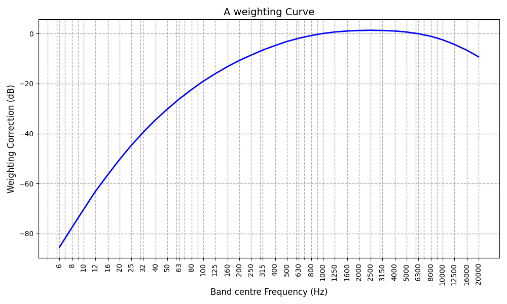
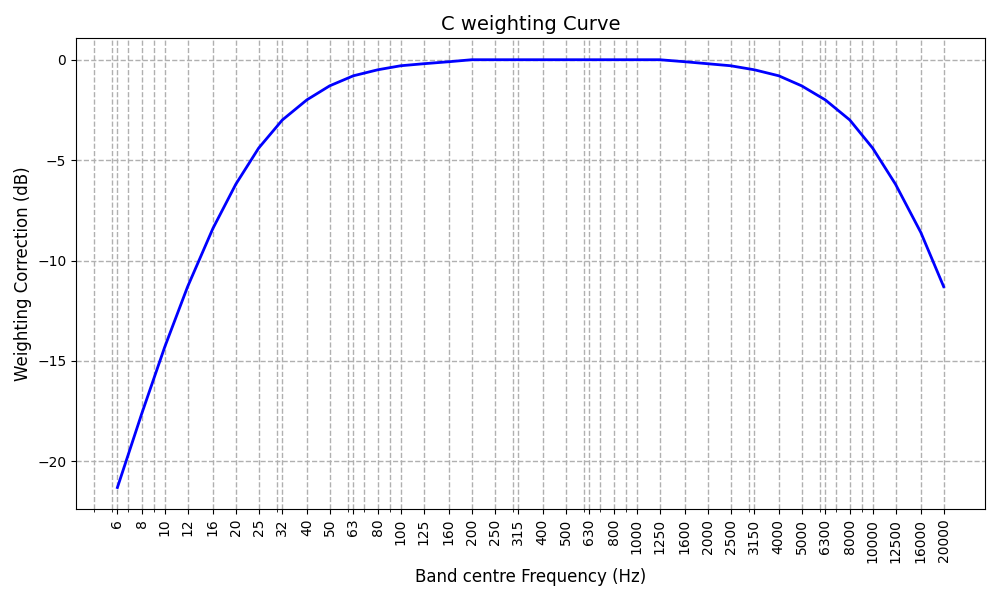
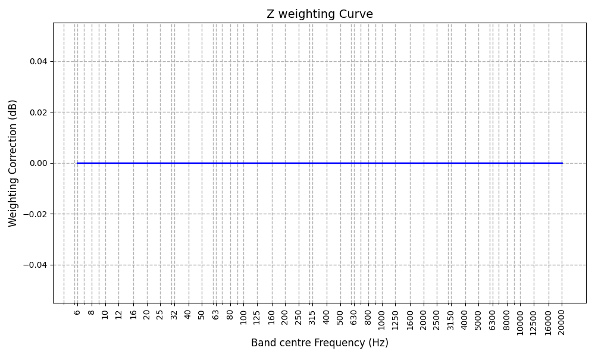
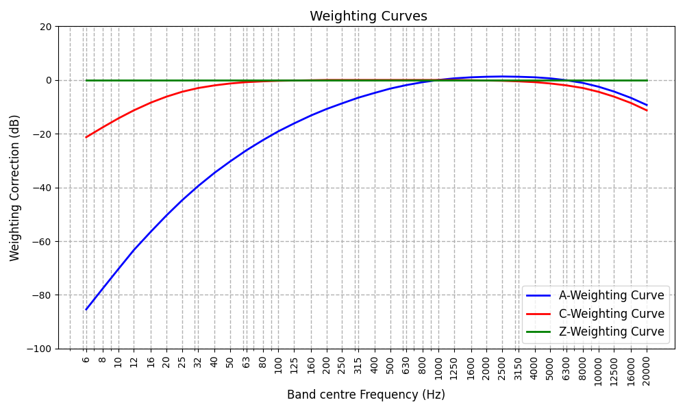

<h1> Acoustic Frequency Weighting Curves </h1>

Project for modeling and visualizing the frequency weighting curves most commonly used in acoustics.

<h2> Table of Contents</h2>

- [A-Weighting curve](#a-weighting-curve)
- [C-Weighting curve](#c-weighting-curve)
- [Z-Weighting curve](#z-weighting-curve)
- [Weighting curves](#weighting-curves)
- [References](#references)

## Intro

Sound pressure levels are frequency-weighted to approximate the sensitivity of human hearing as a function of frequency.

Three commonly used acoustic weighting curves are A, C, and Z.

Negative weighting values indicate attenuation applied to low-frequency components, reflecting the lower sensitivity of human hearing at low frequencies compared to the mid-frequency range between approximately 1 kHz and 4 kHz.

## Install

- Create virtual environment at project root directory

  `python3 -m venv .venv`

- Activate virtual environment

  `source .venv/bin/activate`

- Install dependencies

  `pip install -r requirements.txt`

- Run main script

  `python3 main.py`

## A-Weighting curve

The A-weighting curve approximates the sensitivity of human hearing at moderate sound pressure levels and is widely used in environmental and occupational noise measurements.

## C-Weighting curve

The C-weighting curve provides a flatter frequency response and is commonly used for high-level sound measurements, peak sound pressure evaluation, and low-frequency analysis.

## Z-Weighting curve

The Z-weighting curve represents a flat frequency response with no intentional weighting applied across the audible frequency spectrum.

## Weighting curves

# References

- IEC 61672-1. _Electroacoustics – Sound Level Meters – Part 1: Specifications_.

- Beranek, L. L. _Acoustics_. Acoustical Society of America.

- Bies, D. A.; Hansen, C. H.; Howard, C. Q. _Engineering Noise Control: Theory and Practice_. CRC Press.

- Gómez Acosta, J. J. _Projeto e Desenvolvimento de um Sonômetro de Baixo Custo_. Master's Dissertation, Pontifícia Universidade Católica do Rio de Janeiro (PUC-Rio), 2023. [Available online](https://www.maxwell.vrac.puc-rio.br/colecao.php?strSecao=resultado&nrSeq=67341&idi1=&rc=1).
