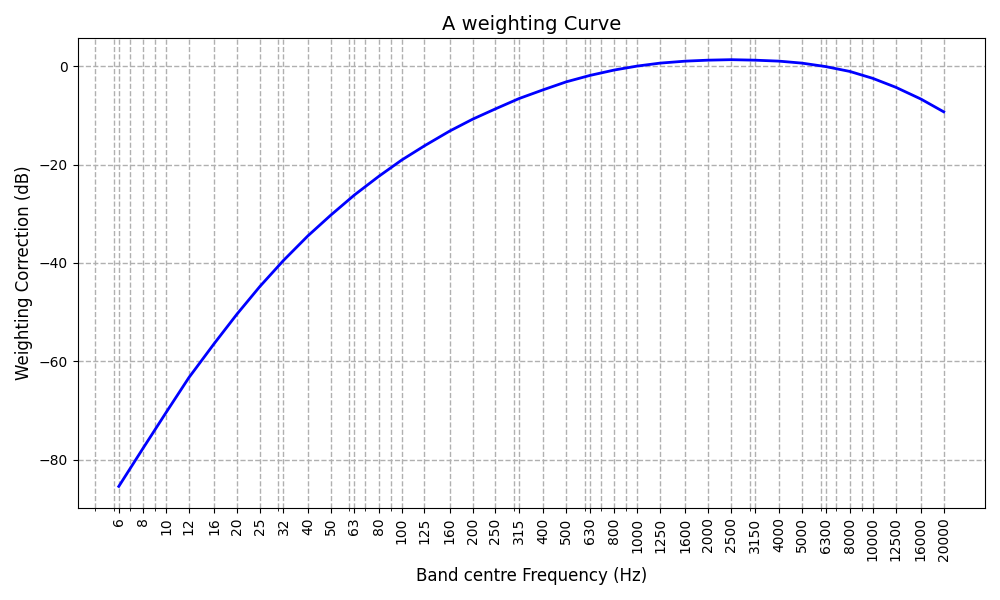
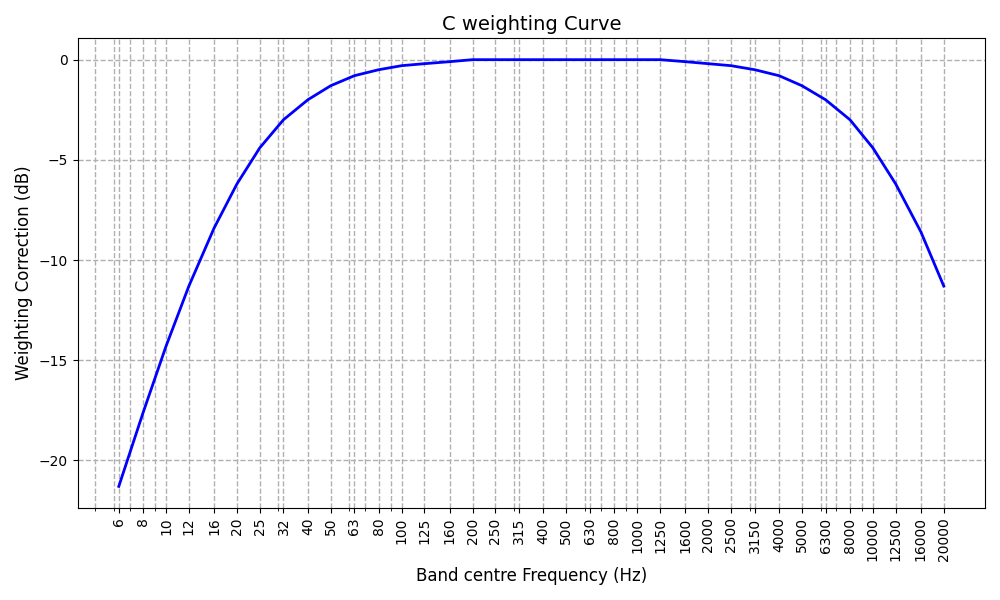
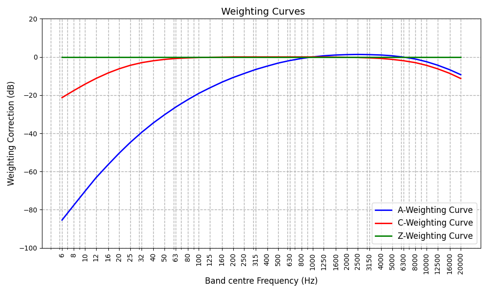

<h1> Acoustic Weighting Curves </h1>

Project that graphs the frequency weighting curves most commonly used in acoustics.

<h2> Table of Contents</h2>

- [Intro](#intro)
- [A-Weighting curve](#a-weighting-curve)
- [C-Weighting curve](#c-weighting-curve)
- [Weighting curves](#weighting-curves)

## Intro

The sound pressure measurement are weighted to represent the human ear’s sensitivity as a function of frequencies. 

Three commonly used acoustic weighting curves are A, C, and Z.

Negative weighting values are associated with low-frequency sounds in the range of 20 Hz to 1 kHz, as the human ear is much less sensitive to low-frequency than higher-frequency sounds in the range of 1 kHz to 4 kHz

## A-Weighting curve

## C-Weighting curve

## Weighting curves

